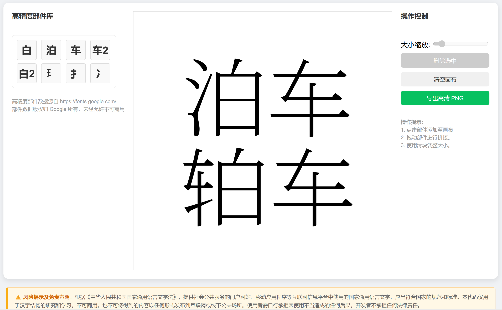

# 中二病也要造汉字

> 交互式汉字部件拼接工具 | 支持手动切割和自动化提取

[](https://opensource.org/licenses/Apache-2.0)
[](https://www.python.org/)

## 效果预览



<p align="center">
  <em>通过拖拽部件自由拼接汉字，支持高清导出</em>
</p>

---

## 项目简介

**中二病也要造汉字** 是一个交互式汉字部件拼接工具，允许用户通过拖拽高精度部件来组合创造新汉字。

### 应用场景

| 场景 | 说明 |
|------|------|
| **汉字教学** | 直观展示汉字结构和部件组合规律 |
| **生僻字设计** | 创造和研究罕见汉字、异体字 |
| **字体设计** | 为字体设计师提供部件参考和拼接预览 |
| **文化学习** | 了解汉字构字规律和偏旁部首知识 |

> **重要提示**：本工具仅用于学习和研究，生成的内容不可用于正式出版或公共展示。详见 [风险提示及免责声明.txt](风险提示及免责声明.txt)

---

## 功能特点

| 功能 | 说明 |
|------|------|
| **交互式拼接** | 基于 Fabric.js 的画布，支持拖拽、缩放、旋转 |
| **高精度部件** | 从 Noto Serif SC 字体提取矢量路径，保证字形质量 |
| **手动切割** | 导出 SVG 到 Inkscape/Illustrator 进行精准切割 |
| **自动提取** | 实验性自动化部件提取（效果有限，建议手动切割） |
| **部件库管理** | 支持添加、命名、保存自定义部件到 radicals.json |
| **高清导出** | 导出 2x 分辨率 PNG 图片，可用于进一步处理 |

---

## 快速开始

### 环境要求

- Python 3.8+
- 现代浏览器（Chrome / Firefox / Edge）

### 安装步骤

```bash
# 1. 克隆项目
git clone https://github.com/你的用户名/chunibyo-demo-create-character.git
cd chunibyo-demo-create-character

# 2. 创建虚拟环境
python -m venv .venv

# 3. 激活虚拟环境
.venv\Scripts\activate          # Windows
source .venv/bin/activate       # macOS / Linux

# 4. 安装依赖
pip install -r requirements.txt

# 5. 下载字体（如 fonts/ 目录为空）
# 从 https://fonts.google.com/noto/specimen/Noto+Serif+SC 下载
# 放入 fonts/ 目录